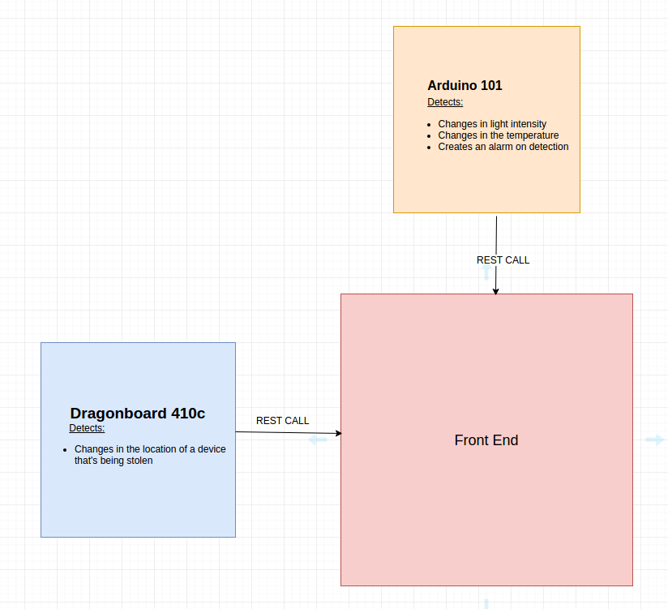

# Device-Theft-and-Malfunction-Detection

</img>

## Inspiration 
We couldn't figure out what we wanted to do as a project, and then we decided to implement a data safety solution.We saw the importance of discarded objects which can be utilized to make profit.

## What it does?

Implemented IoT  devices which prevents damage or theft of sensitive information. We integrated the temperature and the light sensor with IoT device. This will help prevent theft by checking light exposure if it's within the original limits it means the objects are at their own place. The system also prevents damage of the object by sensing the temperature and determining whether the object has caught fire or exposed to heat this is done by emission of temperature sensor on the device.

## How we built it 

Arduino101 was used as a IoT.Then the express server was used to collect and process the data.The dragonboard cluster helps in sensing the location and analysing it.

## Challenges we ran into 
Arduino 101 was very old so the commands we could use and interface were limited.
The Dragon devices had network issues as they were in PEAP encrypted wifi.As these were IoT devices dragonboard went to power saving mode and henc not reachable.

## Accomplishments that I'm proud of 
Coming up with
